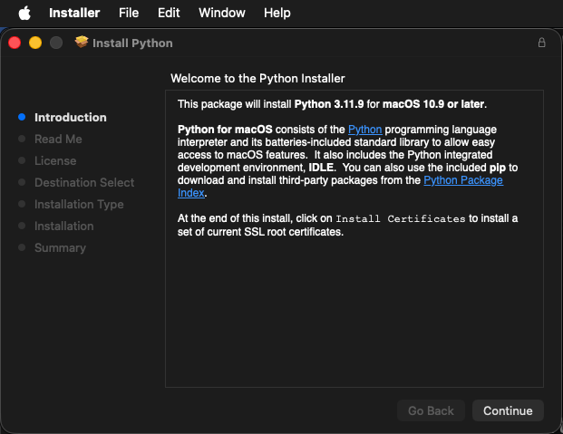
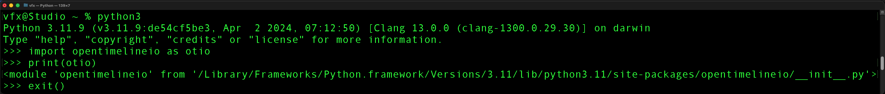

# Lightfielder Operators |  Install Python

## Python on Linux

The average RHEL/Rocky Linux 10.x system is typically running Python 3.12.x on a graphical workstation setup.

If you don't have a copy of Python 3 installed on a RHEL based Linux distro, the dnf package manager can be used from a terminal session to install the Python package:

```bash
sudo dnf update -y
sudo dnf install python3 python3-pip -y
```

**Note:** on REHL based Linux distros, dnf replaces the earlier YUM package manager.

Note: If you are using a Ubuntu based Linux distro you need to use the APT package manager to install Python.

**Note:** Python version 3.12 is a fairly good choice in the year 2026 for a Linux system that is running without a virtual environment like [Conda](https://www.anaconda.com) / [Miniconda](https://www.anaconda.com/docs/getting-started/miniconda/main). If you have a virtual environment, and use it to launch a new session then you are able to more easily use a wider variety of compatible Python versions on the host computer.

## Python on macOS

Python 3 for macOS is no longer bundled with the default OS install after macOS Monterey. Python access requires users to download and run a Python 3 installer which is available from the Official Python website.

**Python 3.11.9 for macOS Download Page**  
[https://www.python.org/downloads/release/python-3119/](https://www.python.org/downloads/release/python-3119/)

**Python 3.11.9 macOS 64 Bit Universal Installer Direct Download**  
[https://www.python.org/ftp/python/3.11.9/python-3.11.9-macos11.pkg](https://www.python.org/ftp/python/3.11.9/python-3.11.9-macos11.pkg)

After you download the Python for macOS .pkg installer file it's a pretty quick process to go through the installation and configuration steps.



The installer will place the supporting Python utilities on disk at:

```bash
/Applications/Python 3.11/
```

## Testing the Python3 Executable

Using the terminal utility you can verify Python v3.11 was installed by typing in:

```bash
python3
```

Note: On some systems the python3 executable will simply be called "python" when there is no Python2 installation present:


```bash
python
```

An interactive Python session will be launched. To quit the python program in the terminal type in:

```pycon
exit()
```

If an active installation of Python 3 is available in the Terminal then you can continue. Paste in the following Python code and press enter to run it:

```pycon
import sys;print(sys.version);print(sys.prefix)
```

The Terminal window should display the following output:

```pycon
Py3\> import sys;print(sys.version);print(sys.prefix)
3.11.9 (v3.11.9:de54cf5be3, Apr  2 2024, 07:12:50) [Clang 13.0.0 (clang-1300.0.29.30)]
/Library/Frameworks/Python.framework/Versions/3.11
```

The second line of text that is output to the Terminal window lists the Python version information.

The third line of text shows where Python is installed on your hard disk. This is useful information for tracking down problems like having two copies of Python 3 installed at the same time, and you don't know the location of the exact Python version that is using right now.

## Pip Package Manager

Pip is the package manager for Python. Check out the [PyPi website](https://pypi.org/) for details on the common Python packages you can use.

You can update your current pip version using:

```bash
pip3 install --upgrade pip
```

If you are running Windows you can update your current pip version using:

```bash
python3 -m pip install --upgrade pip
```

If your python executable is called simply "python" instead of "python3", you can update your current pip version using:

```bash
python -m pip install --upgrade pip
```

## OpenTimelineIO Install

[OpenTimelineIO](https://opentimelineio.readthedocs.io/en/latest/) (OTIO) is an editing timeline interchange library for Python.

The Terminal based install commands for OpenTimelineIO are:

```bash
python3 -m pip install --upgrade pip
pip3 install OpenTimelineIO
pip3 install PySide6
```

If the OTIO library functions as expected you can start a Python3 interactive scripting session in the terminal by typing in:

```bash
python3
```

To validate the install process was successful, you can copy/paste the following block of text  into a new Python3 interactive session in your terminal window:

```pycon
import opentimelineio as otio
print(otio)
exit()
```

If OpenTimelineIO works correctly the terminal window will reply with output text that looks like this:



The result should be:

```pycon
<module 'opentimelineio' from '/Library/Frameworks/Python.framework/Versions/3.11/lib/python3.11/site-packages/opentimelineio/__init__.py'>
```

### OpenTimelineIO Error handling

If you try to run a Ops script that works on timelines, without having OpenTimelineIO installed, you will see an error message. The steps shown in the error dialog will help you fix the missing Python module issue.

The error dialog message content is:

	The OTIO Python module is missing. The macOS & Linux Terminal based install commands for OpenTimelineIO are:

```bash
pip3 install --upgrade pip
pip3 install OpenTimelineIO
pip3 install PySide6
```

### Python Virtual Environments

If you want to use a Python based virtual environment, the two most popular starting points are to use [Anaconda Python](https://www.anaconda.com/)'s Conda virtual environment, or to use the native Python package named "virtualenv":

```bash
pip3 install virtualenv
```

On some systems the pip3 executable will simply be called "pip" in the terminal window. (This is typically the case if there is no pre-existing Python2 installation present.)

```bash
pip install virtualenv
```

## Jupyter Notebook Install

[Jupyter Notebook](https://jupyter.org/) is a popular Python based IDE (integrated Development Environment). It is used extensively in the CV (Computer Vision) and ML (Machine Learning) sectors.

**Note:** Using Jupyter Notebook with Ops is not a required step. Jupyter is typcially used for lens calibration workflows to create the lens distortion correction K1-K3 values.

You can install Jupyter Notebook on macOS from the terminal using:

```bash
pip3 install --upgrade pip
pip3 install jupyter ipykernel
```

You can list the Python version used by the Jupyter software's script interpreter "kernel" using the following  terminal command:

```bash
jupyter kernelspec list
```

The terminal will show a result like:

```bash
Available kernels:
  python3    /Library/Frameworks/Python.framework/Versions/3.11/share/jupyter/kernels/python3
```

After installing the Jupyter Notebook program, you are able to manually start the local Jupyter server instance by hand. 

This software is controlled using a web-browser (Chrome, Safari, Firefox). The starting of a new Jupyter software session is done from the terminal window with one of the following commands:

```bash
jupyter-notebook --browser=Safari
jupyter-notebook --browser=Chrome
jupyter-notebook --browser=Firefox
```

## Removing Python Modules

It's possible to remove the "OpenTimelineIO" and "PySide" Python modules from your workstation. These items were added during the initial installation of Ops.

The macOS & Linux Terminal based Python package uninstall commands for OpenTimelineIO are:

```bash
python3 -m pip install --upgrade pip
pip3 uninstall OpenTimelineIO
pip3 uninstall PySide6
```
