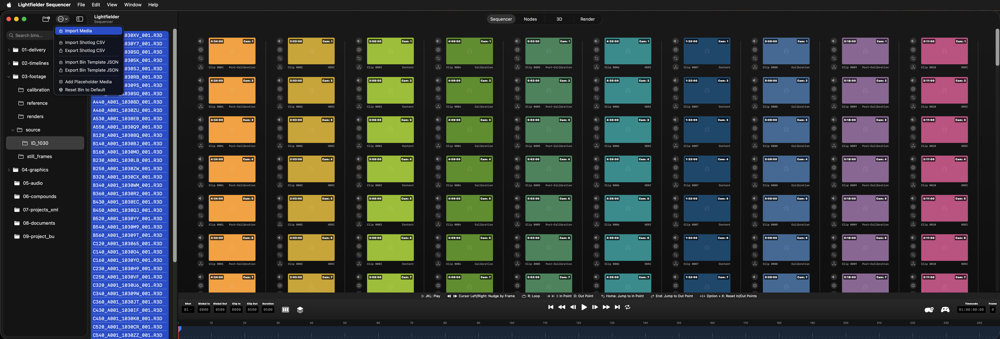

# Lightfielder Operators | Sequencer View

Lightfielder is a primarily a multi-view workflow automation toolset that streamlines the creation of volumetric experiences.

Ops has a clip sequencer that allows multi-view camera array media to be quickly and efficiently navigated and inspected. The Sequencer app can run on iOS, VisionOS, and macOS Catalyst.

 

It doesn't matter if you have 50 cameras, or 200+ cameras in the array, you can check what's up with your latest captures, and generate timecode aligned OpenTimelineIO EDLs on the spot.

Each take of the multi-view footage is grouped into "Stacks" which can be expanded or collapsed on demand.

You can swizzle your stacks between a horizontal or vertical layout to better use available screen space on a monitor. Each stack has several override controls you can toggle On/Off for sound, grades, reframing, and XYZ transforms.
 
## Timeline Controls
 

With the help of stacks for organization, scrubbing the timeline at the bottom of the window, makes quick work of browsing through volumetric camera array media.

## Clip Overlays

The clip duration in time / frames is visible on the top left, and the camera ID / camera name is visible on the top right sides of a clip's shape in the view. Tapping on those textual elements in the UI toggles between their two viewing modes.

The lower left edge label is the clip number like "0003". The lower right edge label holds a Shot Type value such as "Content", "Calibration", etc.


## Gestures

Pressing in the blank area of the sequencer allows you to drag the entire view to scroll the grid up/down.

## Sequencer Work Area

Multi-view content shown in the sequencer work area can be expanded or collapsed using the "stacks" icon in the timeline playbar region, on the left side of the panel.


## Swizzle the Layout

The timeline has several grid view controls such as the layout and the stack controls. The horizontal vs vertical grid layouts allow you to fix the clip shapes to the available area provided by your monitor.

Vertical Layouts are possible and can be scrolled up/down:

Horizontal Layouts are possible and can be scrolled left/right:

