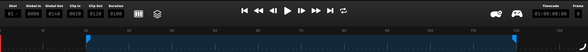
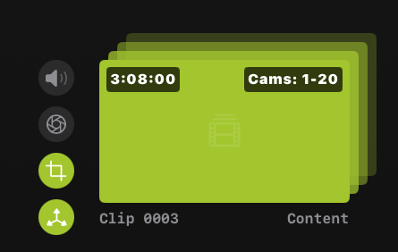
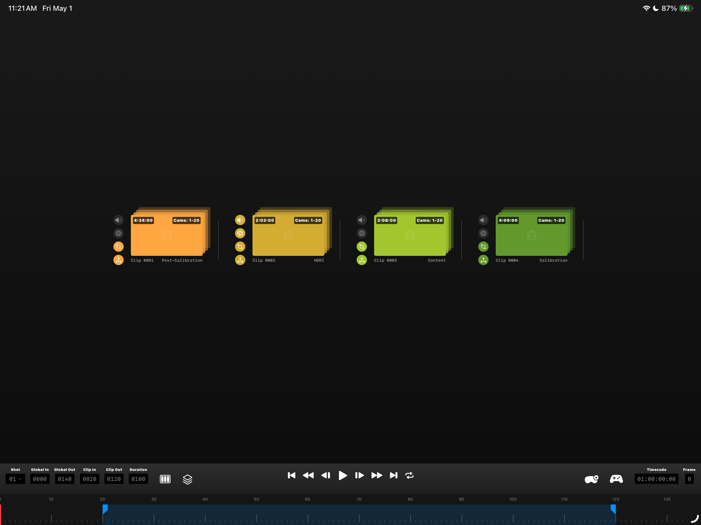
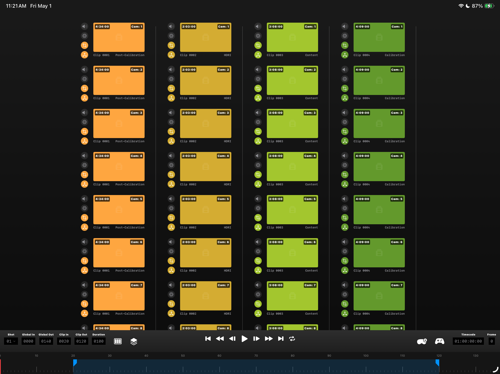
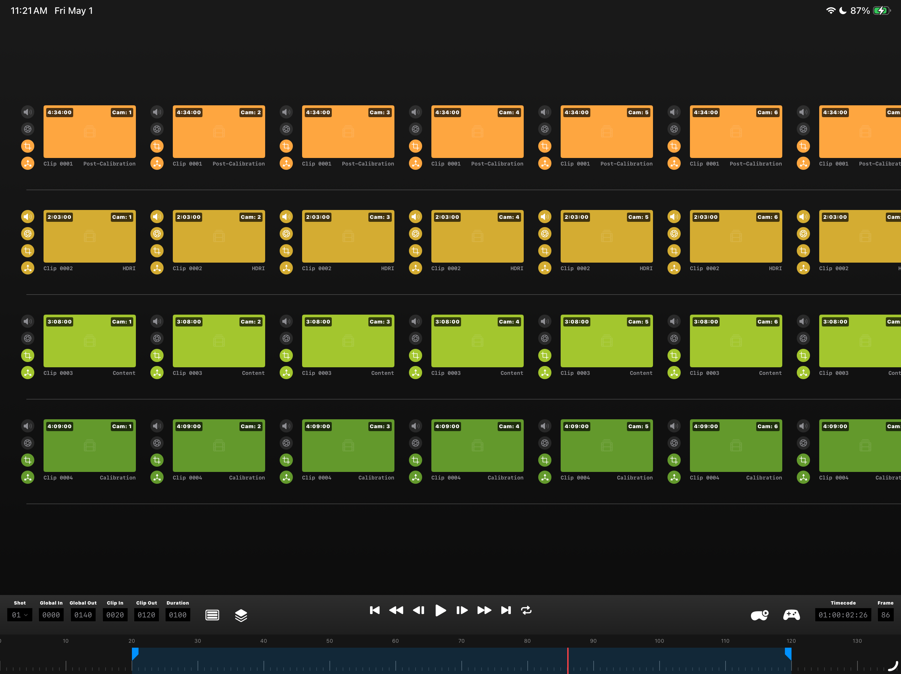

# Lightfielder Operators | Sequencer

Lightfielder is a primarily a multi-view workflow automation toolset that streamlines the creation of volumetric experiences. 

Ops has a clip sequencer that allows multi-view camera array media to be quickly and efficiently navigated and inspected.

The sequencer interface at the bottom of the windoew, makes quick work of browsing through volumetric camera array media, with no prior knowledge of the content being required.

* * *

It doesn't matter if you have 50 cameras, or 200+ cameras in the array, you can check what's up with your latest captures, and generate timecode aligned OpenTimelineIO EDLs on the spot.

Each take of the multi-view footage is grouped into "Stacks" which can be expanded or collapsed on demand.

You can swizzle your stacks between a horizontal or vertical layout to better use available screen space on a monitor. Each stack has several override controls you can toggle On/Off for sound, grades, reframing, and XYZ transforms.

The lower right edge lables, placed ontop of the clip, are typically the clip number like "0003", and the content type like "Content".

* * *

You can spot the clip duration and optionaly the camera ID / camera name on the top left and right sides of a clip's shape in the view?


## Gestures

Pressing in the blank area of the sequencer allows you to then drag the entire view to scroll the grid up/down.

## Grid View

The grid view can be expanded or collapsed using the "stacks" icon in the timeline playbar region, on the left side of the panel.


## Swizzle the Layout

The timeline has several grid view controls such as the layout and the stack controls. The horizontal vs vertical grid layouts allow you to fix the clip shapes to the available area provided by your monitor.

Vertical Layouts are possible and can be scrolled up/down:

Horizontal Layouts are possible and can be scrolled left/right:

