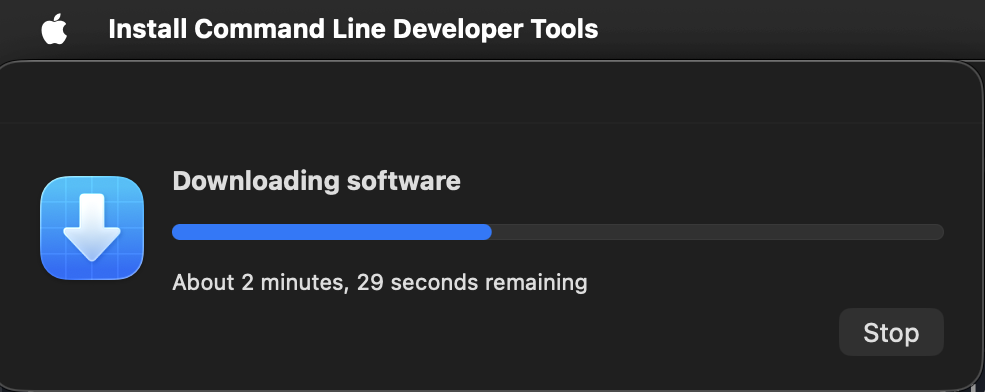
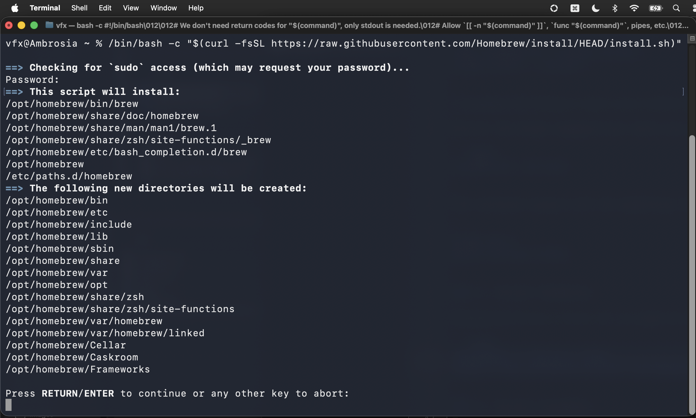
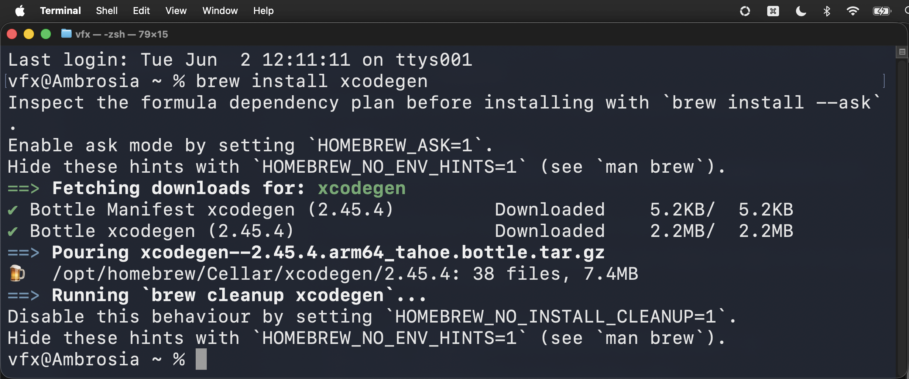
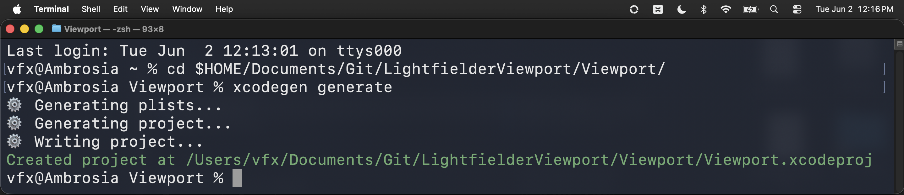
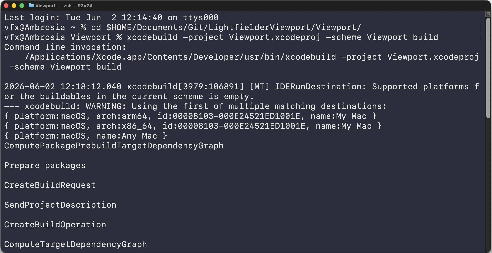
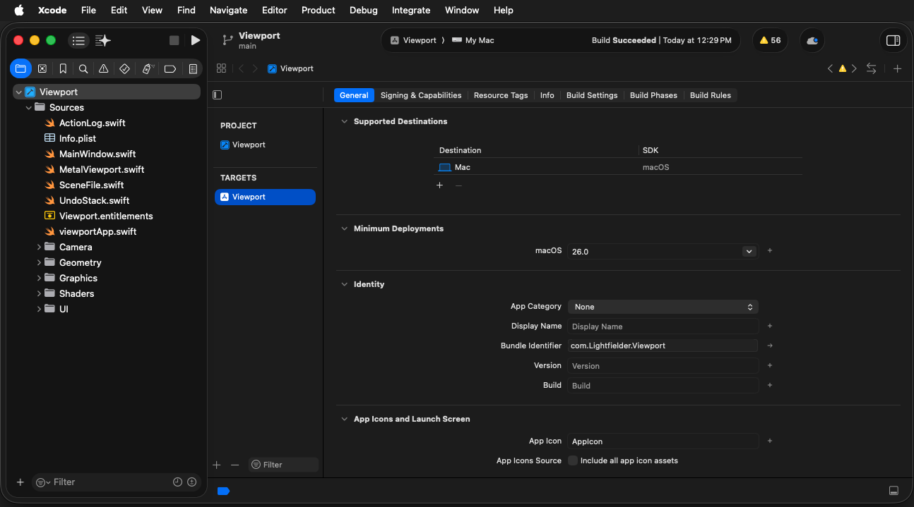
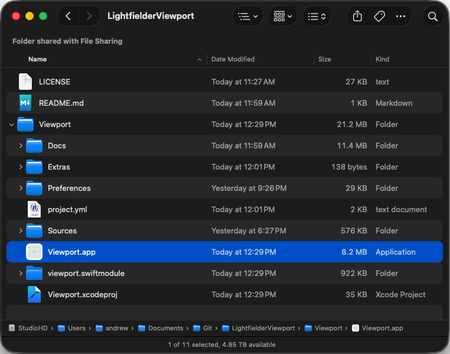
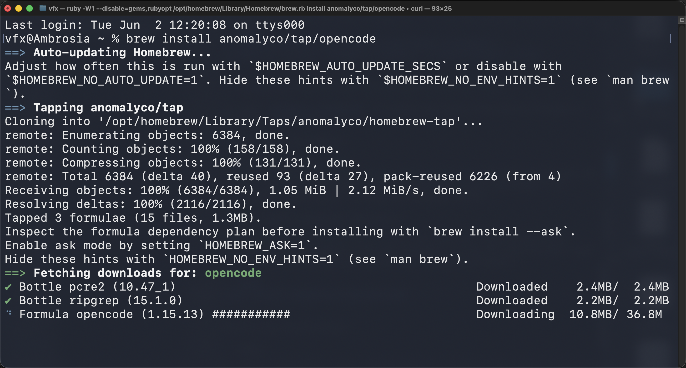
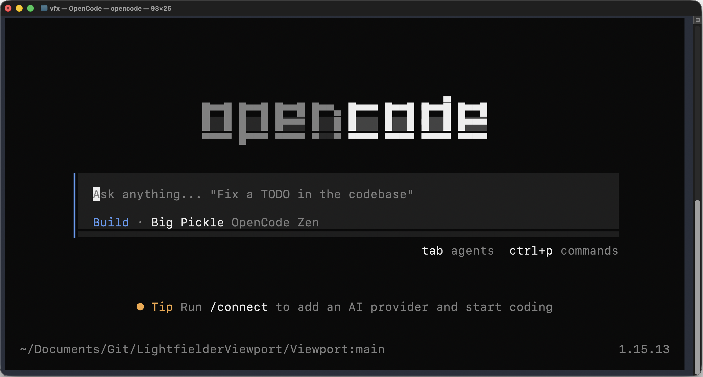

# Lightfielder Viewport | Compiling the Swift App

The Viewport app requires macOS 26.0+ (Tahoe) and the following tools to build:

### 1. Install Xcode

Download and install Xcode 17+ from the Mac App Store or the [Apple Developer site](https://developer.apple.com/xcode/).

After installation, accept the license and install the command-line tools:

```bash
sudo xcodebuild -license accept
xcode-select --install
```



Verify the Xcode command-line tools are active:

```bash
xcodebuild -version
```

The terminal output will be something like:

```
Xcode 26.5
Build version 17F42
```

### 2. Install Homebrew

[Homebrew](https://brew.sh) is used to install XcodeGen:

```bash
/bin/bash -c "$(curl -fsSL https://raw.githubusercontent.com/Homebrew/install/HEAD/install.sh)"
```



After Homebrew finishes installing you can choose to add it to the sytem PATH environment variable:

```bash
echo >> /Users/vfx/.zprofile
echo 'eval "$(/opt/homebrew/bin/brew shellenv zsh)"' >> /Users/vfx/.zprofile
eval "$(/opt/homebrew/bin/brew shellenv zsh)"
```

### 3. Install XcodeGen

XcodeGen generates the `.xcodeproj` file from `project.yml`:

```bash
brew install xcodegen
```



### 4. Build the Project

Regenerate the Xcode project (required after any change to `project.yml` or adding/removing source files):

```bash
cd $HOME/Documents/Git/LightfielderViewport/Viewport/
xcodegen generate
```



Then build with Xcode:

```bash
cd $HOME/Documents/Git/LightfielderViewport/Viewport/
xcodebuild -project Viewport.xcodeproj -scheme Viewport build
```



Or open `Viewport.xcodeproj` in Xcode and build from the UI (Product > Build or `Cmd + B`).



The compiled application is named `Viewport.app` and it is placed in the same folder location as the xcodegen `project.yml` file.



### 5. Apple SF Symbols

The app uses Apple's [SF Symbols](https://developer.apple.com/sf-symbols/) for menu and user interface icons.

### 6. Install OpenCode (Optional)

[OpenCode](https://opencode.ai) is a CLI tool for interacting with AI-powered coding agents from the terminal. It can be used to edit code, run builds, and manage git operations during development.

```bash
brew install anomalyco/tap/opencode
```



Verify the installation:

```bash
opencode --version
```

The terminal output will be something like:

```
1.15.13
```

If required you can use `OpenCode` to edit the Lightfielder Viewport application's source code from SSHing into the macOS system via a remote shell session:

```bash
cd $HOME/Documents/Git/LightfielderViewport/Viewport/;opencode
```



