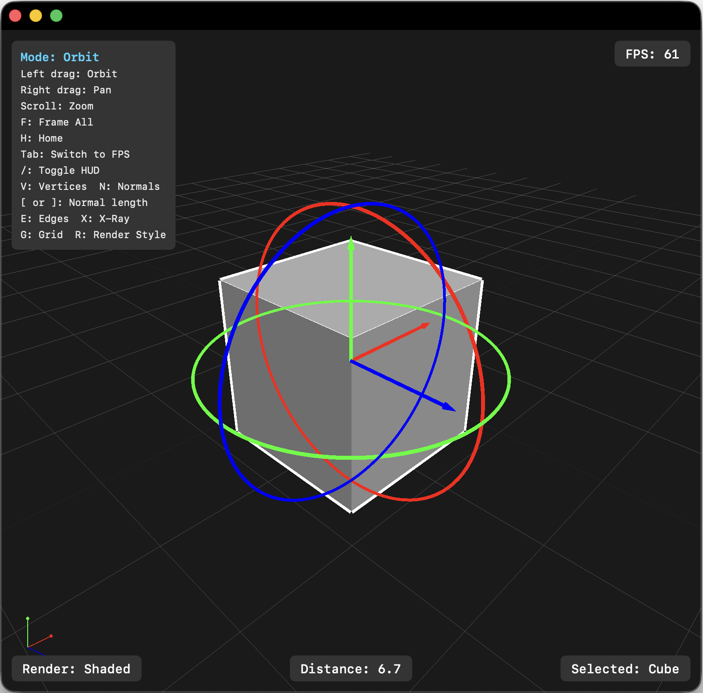
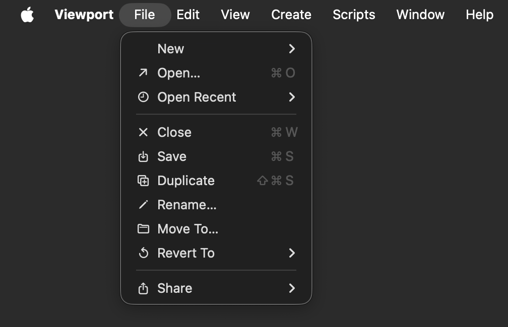
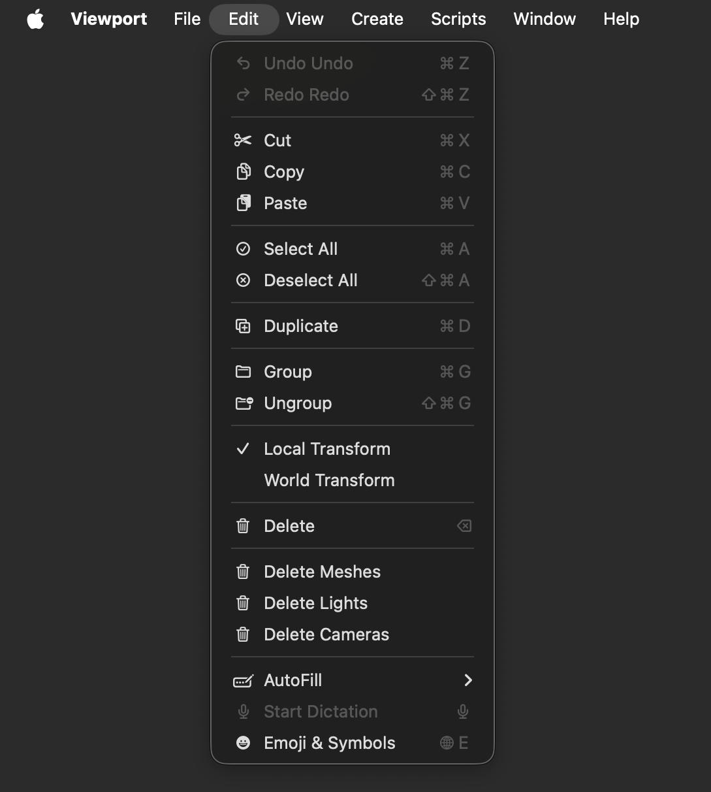
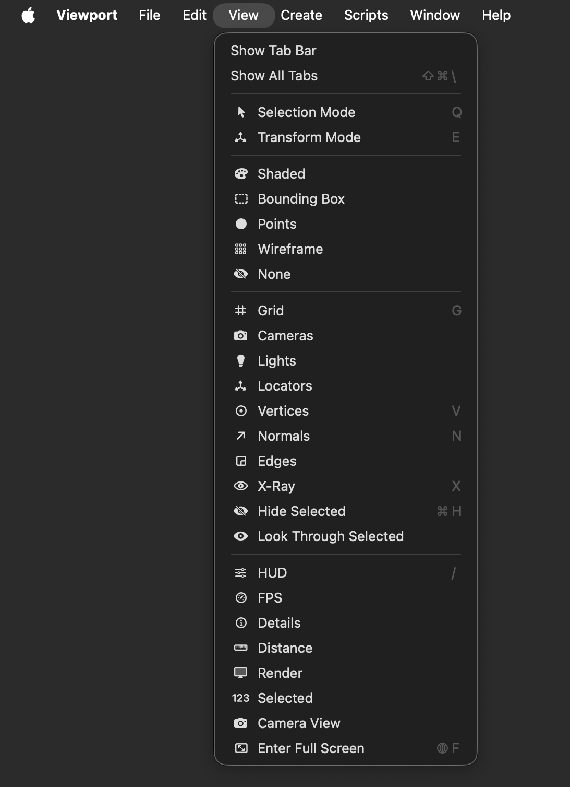
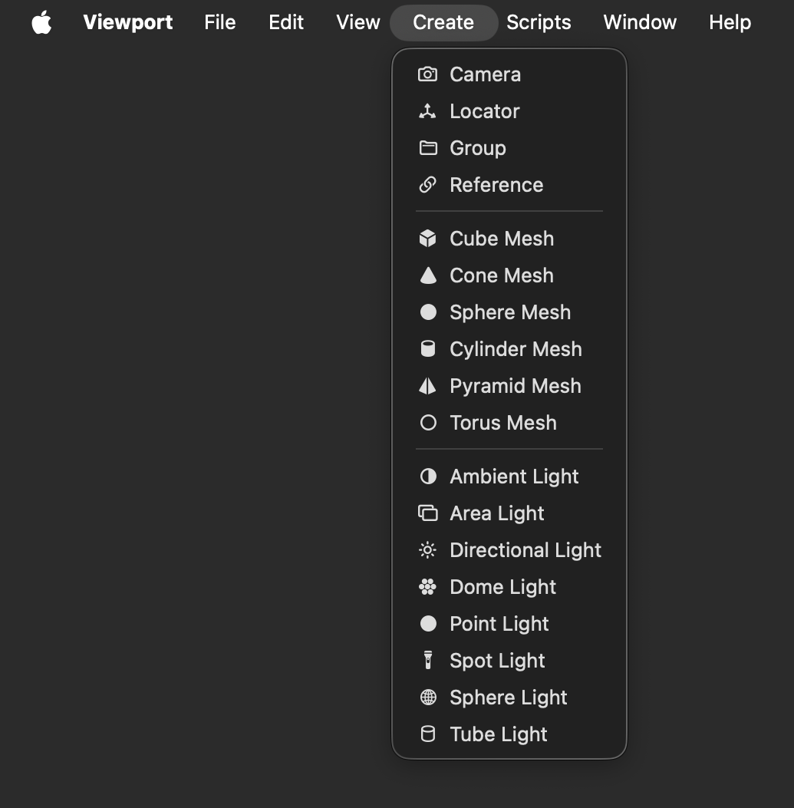
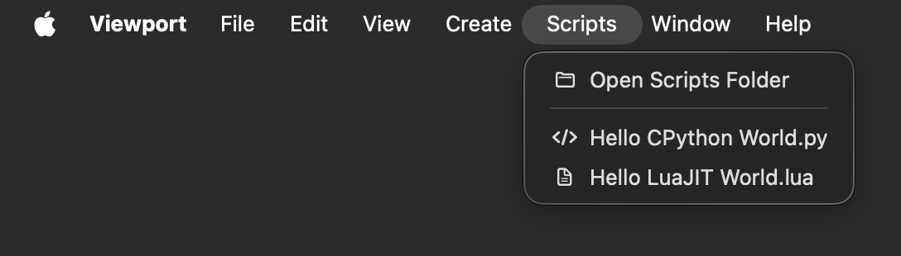
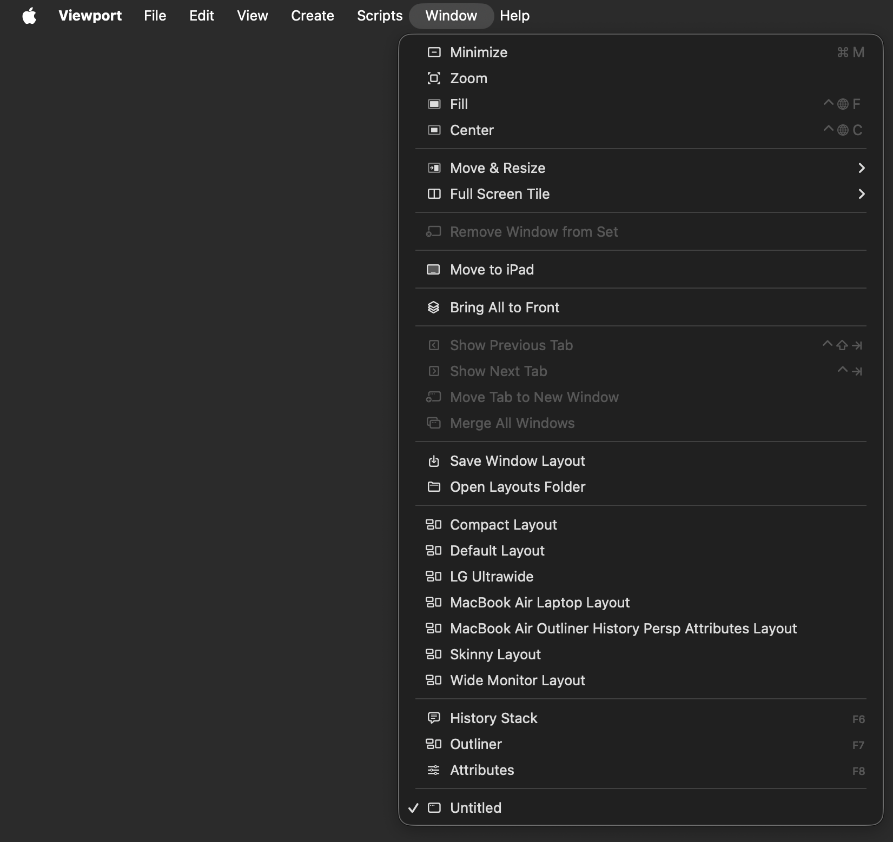

# Lightfielder Viewport | Hotkeys

## General

| Key | Action |
|-----|--------|
| `Tab` | Toggle camera mode (Orbit / FPS) |
| `Q` | Selection mode |
| `E` | Transform mode |
| `F` | Frame all geometry in viewport |
| `H` | Return camera to home position |
| `R` | Cycle render style |
| `F6` | Toggle History Stack window |
| `F7` | Toggle Outliner window |
| `F8` | Toggle Attributes window |

## Display Toggles

| Key | Action |
|-----|--------|
| `G` | Toggle grid |
| `V` | Toggle vertex markers |
| `N` | Toggle face normals |
| `X` | Toggle X-Ray overlay |
| `[` / `]` | Decrease / increase normal length |
| `/` | Toggle HUD visibility |

## Edit

| Shortcut | Action |
|----------|--------|
| `⌘ + Z` | Undo |
| `⌘ + Shift + Z` | Redo |
| `⌘ + X` | Cut |
| `⌘ + C` | Copy |
| `⌘ + V` | Paste |
| `⌘ + A` | Select All |
| `⌘ + Shift + A` | Deselect All |
| `⌘ + D` | Duplicate selected object |
| `⌘ + G` | Group selected objects |
| `⌘ + Shift + G` | Ungroup selected objects |
| `⌫` | Delete selected objects |
| `⌘ + H` | Hide / Show selected object |

## File

| Shortcut | Action |
|----------|--------|
| `⌘ + N` | New Scene |
| `⌘ + O` | Open Scene |
| `⌘ + S` | Save Scene |
| `⌘ + Shift + S` | Save Scene As |

## Mouse Controls (Orbit mode)

| Action | Input |
|--------|-------|
| Orbit | Left drag |
| Pan | Right drag or middle drag |
| Zoom | Scroll wheel |
| Select object | Left click (in Selection mode) |

## Mouse Controls (FPS mode)

| Action | Input |
|--------|-------|
| Look | Left drag |
| Move | WASD / Arrow keys |
| Move up/down | Space / Shift |
| Move forward/back | Scroll wheel |

## Menu Entries

## File

| Item | Shortcut |
|------|----------|
| New > New Document | `⌘ + N` |
| Open… | `⌘ + O` |
| Open Recent > | |
| Save | `⌘ + S` |
| Duplicate | `⌘ + Shift + S` |
| Rename | |
| Move To… | |
| Revert To… | |
| Share | |

## Edit

| Item | Shortcut |
|------|----------|
| Undo | `⌘ + Z` |
| Redo | `⌘ + Shift + Z` |
| Cut | `⌘ + X` |
| Copy | `⌘ + C` |
| Paste | `⌘ + V` |
| Select All | `⌘ + A` |
| Deselect All | `⌘ + Shift + A` |
| Duplicate | `⌘ + D` |
| Group | `⌘ + G` |
| Ungroup | `⌘ + Shift + G` |
| Local Transform | *(checkmark)* |
| World Transform | *(checkmark)* |
| Delete | `⌫` |
| Delete Meshes | *(no shortcut)* |
| Delete Lights | *(no shortcut)* |
| Delete Cameras | *(no shortcut)* |

## View

| Item | Shortcut |
|------|----------|
| Show Tab Bar | |
| Show All Tabs | `Shift + ⌘ + \` |
| Selection Mode | `Q` |
| Transform Mode | `E` |
| Shaded | |
| Bounding Box | |
| Points | |
| Wireframe | |
| None | |
| Grid | `G` |
| Cameras | |
| Lights | |
| Locators | |
| Vertices | `V` |
| Normals | `N` |
| Edges | |
| X-Ray | `X` |
| Hide Selected | `⌘ + H`|
| Look Through Selected | |
| HUD | `/`|
| FPS | |
| Details | |
| Distance | |
| Render | |
| 123 | |
| Selected | |
| Camera View | |
| Enter Full Screen | `Func + F`|

## Create

| Item | Shortcut |
|------|----------|
| Camera | |
| Locator | |
| Group | |
| Reference | |
| Cube Mesh | |
| Cone Mesh | |
| Sphere Mesh | |
| Cylinder Mesh | |
| Pyramid Mesh | |
| Torus Mesh | |
| Ambient Light | |
| Area Light | |
| Directional Light | |
| Dome Light | |
| Point Light | |
| Spot Light | |
| Sphere Light | |
| Tube Light | |

## Scripts

| Item | Shortcut |
|------|----------|
| Open Scripts Folder | |
| Hello CPython World.py | |
| Hello LuaJIT World.py | |

- The `Open Scripts Folder` menu item uses the OS native folder browsing window to show the `~/Library/Application Support/com.Lightfielder.Viewport/Scripts/` folder in Finder.
- The Listed scripts `.py` and `.lua` files in the Scripts folder appear as menu items

## Window

| Item | Shortcut |
|------|----------|
| Bring All to Front | |
| Save Window Layout | |
| Open Layouts Folder | |
| Compact Layout | |
| Default Layout | |
| LG Ultrawide | |
| MacBook Air Laptop Layout | |
| MacBook Air Outliner History Persp Attributes Layout | |
| Skinny Layout | |
| Wide Monitor Layout | |
| History Stack | `F6`) |
| Outliner | `F7` |
| Attributes | `F8` |

- Save Window Layout menu item saves the current window positions/sizes as a `.jsonc` layout file
- Open Layouts Folder menu item opens the Layouts directory in Finder
- Saved layouts menu item shows the previously saved layouts as loadable menu items

## History Stack

The History Stack window (`F6`) displays a three level hierarchy of all undoable actions in collapsible speech-bubble capsules. Each event block shows a timestamp, duration, and category color. Events of the same category are automatically grouped into a parent capsule with dynamically appended children.

## Three-Level Hierarchy

1. **Exploration Blocks** (root level)  
	Each creative iteration is wrapped in an "Exploration N" block. When you undo then perform new actions, a new exploration block is automatically created, preserving old history as inactive (diagonal stripe overlay). Click the `+` button in the toolbar to manually create a new exploration branch. Click an exploration block's title to inline-rename it.

2. **Category Groups** (children of exploration blocks)  
	Auto-grouped by event category (Navigation, Display Toggles, Selection, Create, etc.). Each category group composites its undo/redo across all its individual operations. Undo/redo at this level is `⌘+Z`/`⌘+Shift+Z` within the current block (within-block undo), or jumps between entire exploration blocks (block-level undo when at block boundaries).

3. **Individual Operations** (children of category groups)  
	Atomic events like "Zoom", "Pan", "Toggle Wireframe", "Adjust Up". Always undone/redone as part of their parent category group.

## Undo/Redo Behavior

- **Within-block**  
	  `⌘+Z` undoes the last category group in the current exploration block. `⌘+Shift+Z` redoes the last undone category group. Each category group's children are undone/redone together.

- **Block-level**  
	When at the first category group of a block, `⌘+Z` jumps to the previous exploration block (undoing all its events). `⌘+Shift+Z` from a fully-active block jumps to the next exploration block. Block-level navigation is also available via the ↩/↪ buttons on each block.

- **Exploration branching**  
	If you undo to a previous block and perform new actions, a new "Exploration N" block is created with those actions, while the old future blocks remain visible as inactive history. You can always navigate back to them.

## Save / Load

The Load and Save toolbar buttons default to the `History/` subfolder under `~/Library/Application Support/com.Lightfielder.Viewport/`. Saved JSONC files store the full event tree including event IDs, categories, timestamps, elapsed times, the current undo/redo position, within-block undone event IDs, and per-event fold/unfold states. Loading a file fully restores the History Stack UI to its saved state.

## Toolbar

| Button | Action |
|--------|--------|
| Open Events | Load `.jsonc` history file from disk |
| Save Events | Save history to `.jsonc` file |
| Trash | Clear all events and start fresh |
| `+` (orange) | Create a new exploration block manually |
| Compress | Fold all group capsules |
| Expand | Unfold all group capsules |

## Event Categories

| Category | Color | Icon | Examples |
|----------|-------|------|----------|
| Exploration | Orange | `point.topleft.down.curvedto.point.bottomright.up` | Exploration 1, Exploration 2 |
| Edit | Red | `pencil` | Delete, Delete Meshes, Delete Lights, Delete Cameras, Duplicate |
| Selection | Pink | `checkmark.circle` | Select All, Deselect All, Solo On/Off |
| Navigation | Cyan | `move.3d` | Orbit, Pan, Zoom, Move, Frame All, Go Home |
| Nav Group | Cyan | `square.stack.3d.forward.dottedline` | Navigation (grouped) |
| Mode | Purple | `arrow.triangle.swap` | Switch to orbit/fps |
| Display | Green | `eye` | Grid, Wireframe, X-Ray, HUD, Vertices, Normals toggles |
| Normal Length | Orange | `arrow.up.arrow.down` | Adjust Up/Down |
| Create | Blue | `plus.square` | Create Cube, Sphere, Camera, Locator |
| Light | Yellow | `lightbulb` | Set Light |
| Scene | White | `doc` | New/Open/Save Scene |
| Visibility | Teal | `eye.fill` | Show/Hide object, Enable/Disable light, Solo |
| Transform | Mint | `arrow.triangle.2.circlepath` | Selection Mode, Transform Mode |
| Reparent | *(default)* | *(default)* | Group, Ungroup, Reparented |
