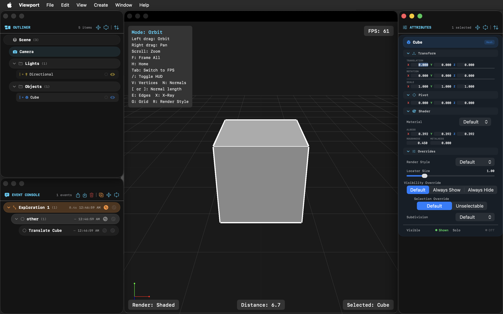
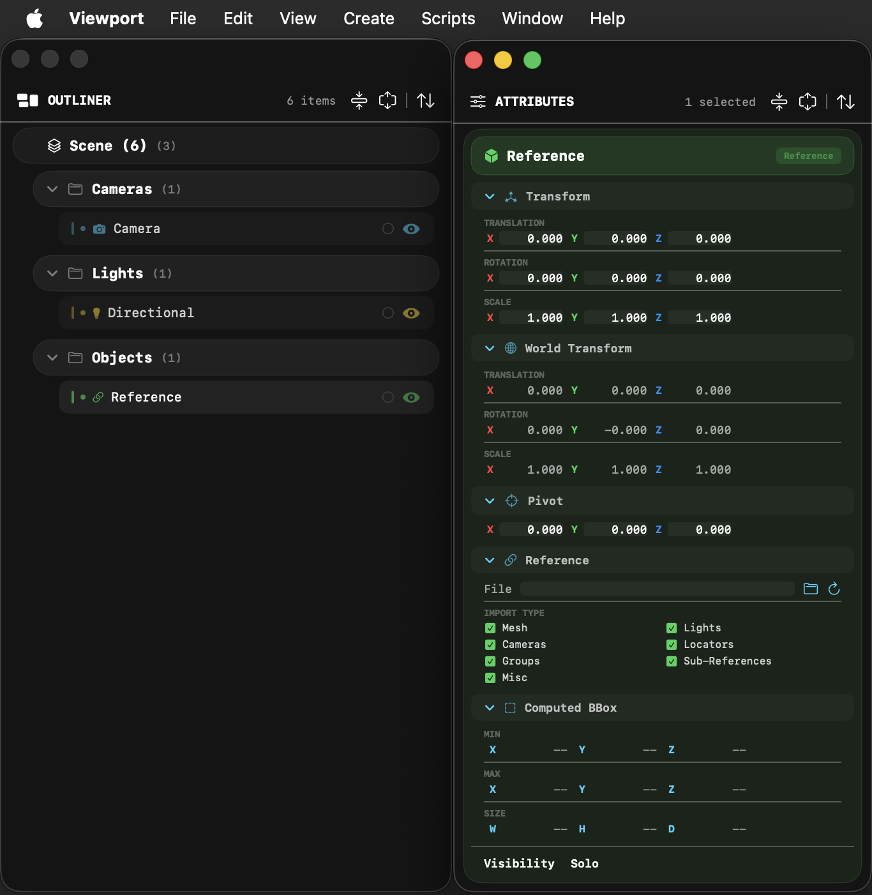

# Lightfielder Viewport v26.10

## Overview

Tired of juggling multiple 3D tools? Lightfielder is a hybrid computer-vision IDE/DCC toolset that unifies volumetric content creation from a single workspace.The goal is to make it easier to mix LiDAR scans of large environments, spatial audio, gaussian splats, video photogrammetry, etc into one purpose-built XR authoring environment. 

Lightfielder Viewport provides a digital content creation environment for authoring XR experiences. It streamlines volumetric video post-production with a highly specialized set of tools that are optimized and tuned for advanced HPC (High Performance Computing) workflows.

This Lightfielder toolset feels like a mix of the most relevant ideas found in game engines. It also provides DCC (digital content creation) scene assembly capabilities typically found in big box 3D modelling, rendering and animation software. Those features are combined with a side-order of 3d scaning sector focused options you would normally need to access inside a dedicated SfM (Structure from Motion) based 3D recontruction program.

Viewport v1.0 beta is a [Swift language](https://www.swift.org/) based application that relies on [Metal API](https://developer.apple.com/metal/) based GPU acceleration to power the interactive session. The Viewport development effort was bootstrapped using open-source LGPL licensed [Kartaverse](https://github.com/Kartaverse) technology.

(Click to play the Youtube Video)

A cross-platform compatible Viewport application port is underway. This uses the very efficient and high performance tuned [Rust](https://rust-lang.org/) programming language, with the [GPUI](https://github.com/Lightfielder/GPUI-Window-Toolkit) window toolkit library, and [Vulkan](https://www.vulkan.org/) based 3D graphics.

(Click to play the Youtube Video)

## XPU Based Rendering on Linux, macOS, and Windows

Additionally, there is ongoing XPU (CPU + GPU accelerated) hybrid rendering research for the Lightfielder software. The goal is to support the inclusion of the [Luisa Render](https://github.com/Lightfielder/LuisaRender) software as an interactive graphics viewport output driver. Our Lightfielder development work so far indicates Luisa is among the most performant options out there for a renderer toolset that has broad CPU and GPU support across many hardware architectures. It's simply amazing using the renderer on macOS!

In the lab, the benchmarks we've done in-house show that Luisa Render running with the [LLVM compiler infrastructure](https://llvm.org/) is able to have an Apple MacStudio (192 GB RAM M2 Ultra) system with a GPU renderer kernel beat an AMD Threadripper (3990X 64-core CPU / 128 thread) system. To put it mildly, that is some very impressive code optimization at work by the LuisaRender team! 😃

## Scene Assembly and Asset Referencing

The Viewport application is a great option for scene assembly and layout. It has powerful referencing tools that allow for externally referenced assets, and entire pre-composed scenes to be loaded. This helps power scene assembly tasks with ease and allows for deeply nested hierarchies. The Viewport scene file format and the clipboard copy/paste buffer both use JSON formatted files which are pipeline automation friendly, and makes it easy to dynamically construct referencable assets.

## History Stack / Script Listener

There is a full undo/redo "history stack" system in the application that acts like a script listener. The recorded history events can be loaded/saved to disk in a JSON format. This allows rapid building of new automation operations by tracking an artist lead creation session. There is an idea of "explorations" in the history stack where you can create non-distructive branches in the undo state event logs to allow alternative ideas to be explored.

## Table of Contents

- [ReadMe (You are here)](README.md)
- [ChangeLog](ChangeLog.md)
- [Hotkeys](Hotkeys.md)
- [User Interface](UserInterface.md)
- Tutorials
	- TBD
- Compiling
	- [Swift Language](Swift.md)
	- [Rust Language](Rust.md)

## GitHub Downloads

Go to the Releases page to access the latest builds. 

The v26.06 update in May added initial support for Sony Playstation DualSense gamepad input devices.
