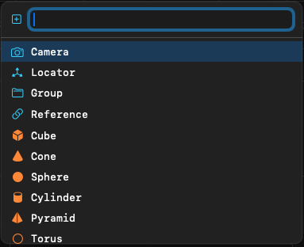
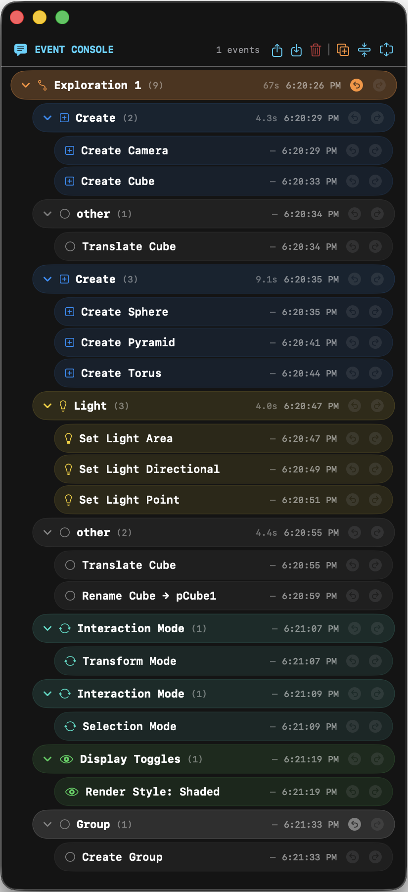
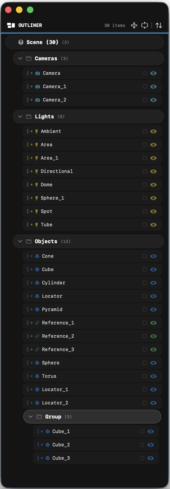
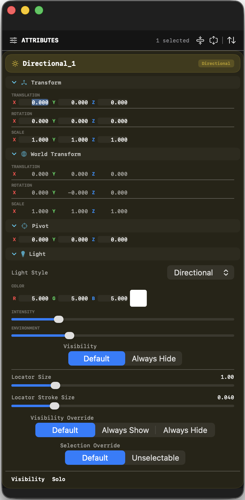
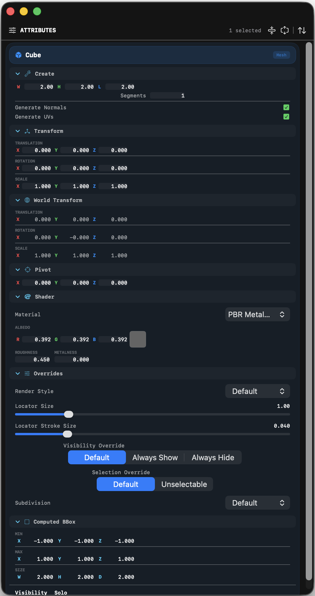
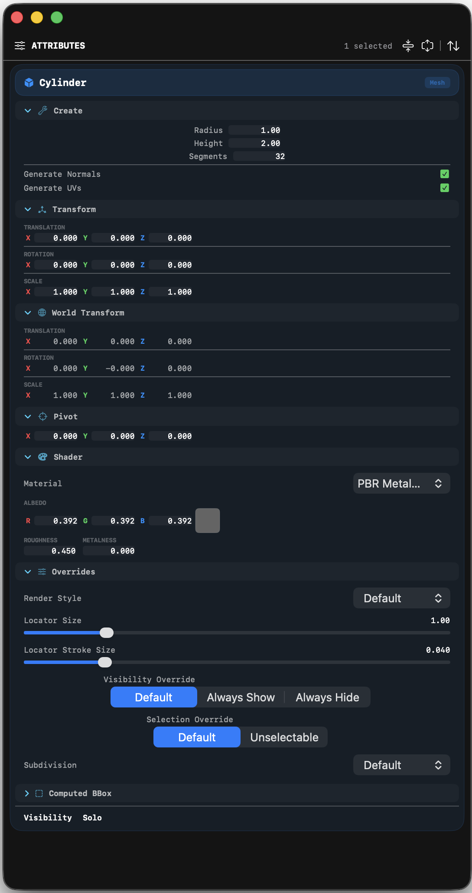

# Lightfielder Viewport | User Interface

## Create Dialog

Press the (`Tab`) key in the perspective view to display the create dialog. This is how you can add meshes, lights, cameras, and other items to the 3D scenegraph.

The Create Dialog supports autocomplete of partial object names. Press enter/return to add the item to the scene. Press Escape to cancel the dialog and hide it.

## History Stack

The History Stack window (`F6`) displays a tree view of the undo/redo events for the current session.

The History Stack window features include:

- **Hierarchy tree**   
    Explorations, Undo Event Class, Event Items
- **Fold/Unfold All**  
    Toolbar buttons to collapse or expand all property sections at once.
- **Window position persistence**  
    Size and position are saved and restored across launches. Preferences are auto-saved on quit, new scene, and window move/resize. External `Windows.jsonc` files can be imported via File > Open or drag-and-drop to apply a saved window layout.
- **Double-click rename**   
    Double-click an item's name to enter inline editing. Press Enter to confirm.

## Outliner Window

The Outliner window (`F7`) displays a tree view of the scene hierarchy with a dark aesthetic matching the History Stack.

The Outliner window features include:

- **Hierarchy tree**  
    Scene, Camera, Lights, Objects with expandable/collapsible group rows, drag-to-reparent
- **Fold/Unfold All**   
    Toolbar buttons to collapse or expand all property sections at once.
- **Visibility toggle**   
    Click the eye icon to show/hide an item. Eye icon state reflects the current visibility.
- **Solo mode**  
    Click the solo circle button (left of the eye) to temporarily isolate one item, hiding all others of the same type. Click again to restore the previous visibility state.
- **Solo override**   
    The solo state is a temporary override; the underlying visibility settings are preserved as a backup and restored when solo is deactivated.
- **Shift-click multi-select**  
    Hold Shift and click to add/remove individual mesh items from the selection set.
- **Command+click visibility** 
    Hold Command and click the eye icon to solo-show the clicked item (hides all other items of the same type).
- **Command+Shift+click visibility**   
    Toggles all items of the clicked type to the same visibility state as the clicked item.
- **Double-click rename**   
    Double-click an item's name to enter inline editing. Press Enter to confirm. Illegal characters (`:`, `/`, `\`) are stripped. If the new name conflicts with an existing object, it is auto-numbered (e.g., `Cube_2`).
- **Selection highlighting**   
    Selected items are highlighted with a brighter background and stroke border.
- **Window position persistence**   
    Size and position are saved and restored across launches. Preferences are auto-saved on quit, new scene, and window move/resize. External `Windows.jsonc` files can be imported via File > Open or drag-and-drop to apply a saved window layout.

### Outliner Visibility Interactions

| Action | Behavior |
|--------|----------|
| Click eye icon | Toggle single item visibility |
| Command + click eye | Solo show: hide all other same-type items |
| Command + Shift + click eye | Batch toggle all same-type items to match clicked item |
| Click solo circle | Activate/deactivate solo mode (temporary visibility override) |

## Attributes Window

The Attributes window (`F8`) displays an inspector for editing properties of the currently selected object(s). It shares the same dark aesthetic and fold/unfold toolbar pattern as the Outliner and History Stack windows. 

The Attributes window features include:

- **Multi-object support**   
    When multiple objects are selected, each object is displayed in its own speech-bubble-style block with a distinct header and collapsible property sections.
- **Object rename**    
    Double-click the object name in the speech bubble header to enter inline rename mode. Press Enter to confirm.
- **Transform section**    
    Edit Translation, Rotation, and Scale as X/Y/Z float triplets with axis-colored text fields (red X, green Y, blue Z).
- **Pivot section**    
    Set the local pivot point offset as an X/Y/Z triplet.
- **Shader section**    
    Select from available material presets and edit per-object PBR material properties including Albedo (RGB), Roughness, Metalness, and F0.
- **Render Style Override**    
    Override the global shading mode per object with options: Default, Shaded, Bounding Box, Points, Wireframe, None.
- **Locator Size**    
    Per-object slider (0.1 – 5.0) controlling the size of the transform control handle and locator icon in the scene. A value of 1.0 uses the default size.
- **Locator Stroke Size**    
    Per-object slider controlling the tube radius of locator wire shapes.
- **Visibility Override**  Selectable segmented control: Default, Always Show, or Always Hide.
- **Selection Override**    
     Segmented control: Default or Unselectable. Unselectable prevents mesh picking on the object in the viewport.
- **Subdivision Smoothing**    
     Picker with options: Default, None, Catmull-Clark (classic Pixar OpenSubdivision-style surface smoothing).
- **Status indicators**    
     Read-only display of the object's current Visible (Shown/Hidden) and Solo (Active/Off) state.
- **Fold/Unfold All**    
     Toolbar buttons to collapse or expand all property sections at once.
- **Window position persistence**    
     Size and position are saved and restored across launches, defaulting to a 300px-wide panel docked to the right of the viewport. Preferences are auto-saved on quit, new scene, and window move/resize.

### Parametric Mesh Generators

The Mesh objects have a "Create" section as the first foldable section. This allows for a parametric generation of the surface with control over object size, the number of polygon subdivisions, and the tessellation.

